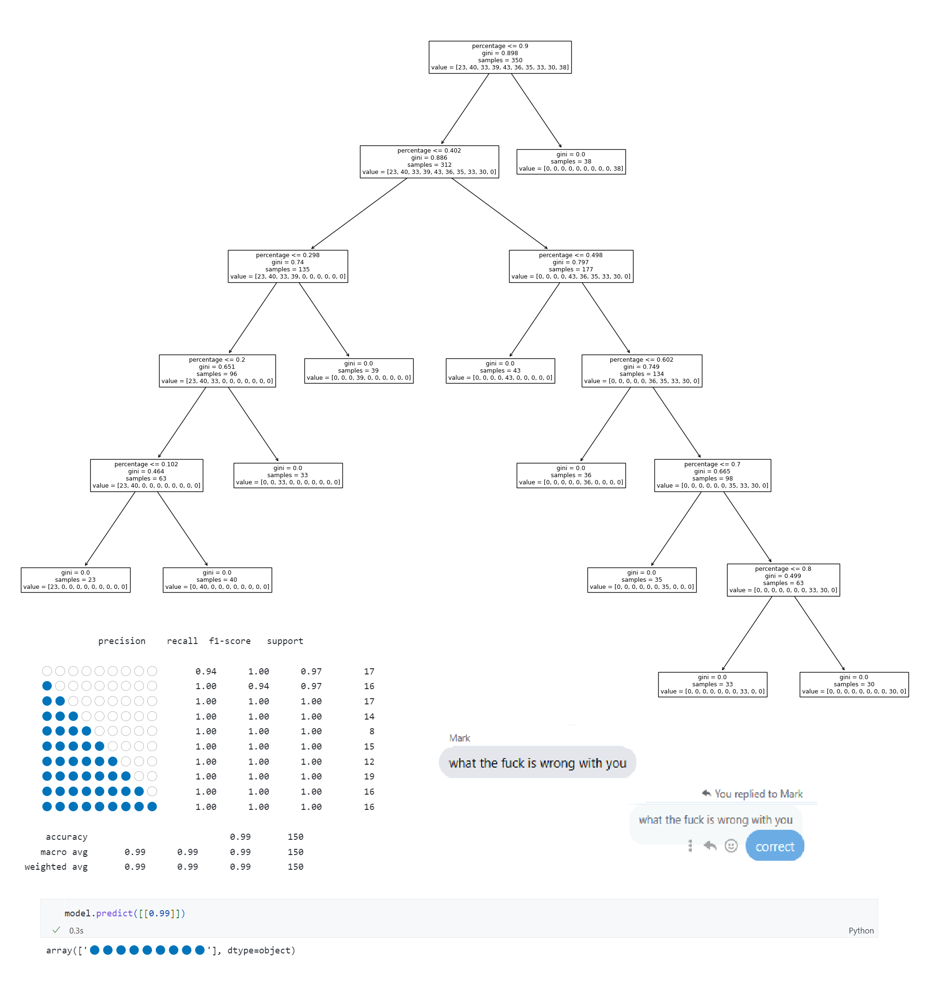

# unnecessary-steps-for-GetPercentageRounds
A DecisionTreeClassifier approach for a meme running around in the programming community of how the Dutch Government displays their percentages.

While it is a complete eyesore and can be done dynamically or better, it serves its purpose. So people took to themselves to make it better by doing it dynamically or using switch cases.

*Credits to u/Marcus_Analyticus*

Now I am here to make it worse by implementing it using Decision Tree Classifiers.

